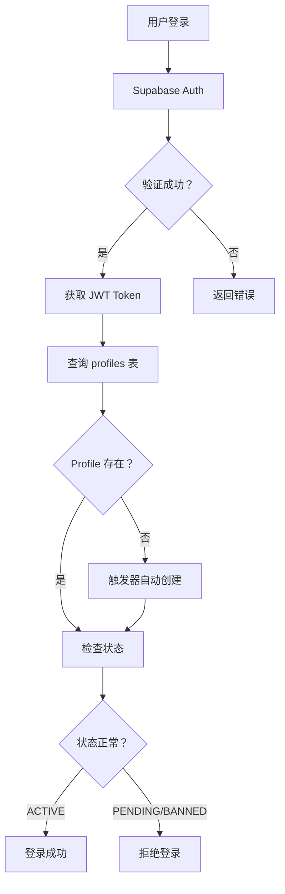

# Supabase 认证架构 - 快速参考指南

## 📖 目录速查
- [1. 核心概念](#1-核心概念)
- [2. 代码片段](#2-代码片段)
- [3. 常见问题](#3-常见问题)
- [4. 最佳实践](#4-最佳实践)
- [5. 故障排查](#5-故障排查)

---

## 1. 核心概念

### 数据库结构
```
auth.users (Supabase 管理)
    └── id (UUID) → profiles.id
   
public.profiles (业务扩展)
    ├── id (FK → auth.users.id)
    ├── email
    ├── role ('user' | 'admin')
    ├── admin_level ('user' | 'admin' | 'super_admin')
    ├── status ('ACTIVE' | 'PENDING' | 'BANNED')
    └── 其他业务字段...
```

### 认证流程


---

## 2. 代码片段

### 2.1 标准登录
```typescript
import { supabase } from '@/lib/supabase';

// 邮箱密码登录
const handleLogin = async (email: string, password: string) => {
  const { data, error } = await supabase.auth.signInWithPassword({
    email,
    password,
  });
  
  if (error) throw error;
  
  // 查询 profile
  const { data: profile } = await supabase
    .from('profiles')
    .select('status, role, admin_level')
    .eq('id', data.user.id)
    .single();
  
  // 检查状态
  if (profile?.status !== 'ACTIVE') {
    await supabase.auth.signOut();
    throw new Error('账户状态异常');
  }
  
  return { user: data.user, profile };
};
```

### 2.2 手机号 OTP 登录
```typescript
// 发送验证码
await supabase.auth.signInWithOtp({
  phone: `+86${phone}`,
});

// 验证并登录
const { data, error } = await supabase.auth.verifyOtp({
  phone: `+86${phone}`,
  token: otp,
  type: 'sms',
});
```

### 2.3 注册新用户
```typescript
const handleSignUp = async (email: string, password: string, fullName: string) => {
  const { data, error } = await supabase.auth.signUp({
    email,
    password,
    options: {
      data: {
        full_name: fullName,
      },
    },
  });
  
  // 触发器会自动创建 profile，无需手动插入
  return data;
};
```

### 2.4 使用 useAuth Hook
```typescript
import { useAuth } from '@/contexts/AuthContext';

function MyComponent() {
  const { user, profile, loading, isAdmin, isSuperAdmin } = useAuth();
  
  if (loading) return <div>加载中...</div>;
  if (!user) return <Navigate to="/login" />;
  
  return (
    <div>
      <h1>欢迎，{profile?.username}</h1>
      {isAdmin && <button>管理功能</button>}
    </div>
  );
}
```

### 2.5 路由守卫
```typescript
import { ProtectedRoute } from '@/components/shared/ProtectedRoute';

// 仅需登录
<Route element={<ProtectedRoute />}>
  <Route path="/dashboard" element={<Dashboard />} />
</Route>

// 需要管理员
<Route element={<ProtectedRoute allowedRoles={['admin', 'super_admin']}>}>
  <Route path="/admin/users" element={<UserManagement />} />
</Route>

// 仅超级管理员
<Route element={<ProtectedRoute requireSuperAdmin>}>
  <Route path="/admin/settings" element={<Settings />} />
</Route>
```

---

## 3. 常见问题

### Q1: Profile 何时创建？
**A**: 通过数据库触发器自动创建。当用户在 `auth.users` 注册时，触发器 `on_auth_user_created` 会自动在 `profiles` 表创建记录。

```sql
-- 触发器已部署，无需手动调用
CREATE TRIGGER on_auth_user_created
  AFTER INSERT ON auth.users
  FOR EACH ROW EXECUTE FUNCTION public.handle_new_user();
```

### Q2: 如何添加新角色？
**A**: 修改 `profiles` 表的 CHECK 约束和类型定义。

```sql
-- 1. 修改数据库约束
ALTER TABLE profiles 
DROP CONSTRAINT IF EXISTS profiles_role_check;

ALTER TABLE profiles 
ADD CONSTRAINT profiles_role_check 
CHECK (role IN ('user', 'admin', 'editor', 'moderator'));

-- 2. 更新 TypeScript 类型
type Role = 'user' | 'admin' | 'editor' | 'moderator';
```

### Q3: 如何实现临时访问权限？
**A**: 使用 `admin_level` 字段或扩展权限系统。

```typescript
// 方法 1: 使用现有 admin_level
await supabase
  .from('profiles')
  .update({ admin_level: 'admin' })
  .eq('id', userId);

// 方法 2: 扩展 permissions 数组字段
await supabase
  .from('profiles')
  .update({ 
    permissions: ['edit_posts', 'delete_comments'],
    permission_expiry: new Date('2026-12-31').toISOString()
  })
  .eq('id', userId);
```

### Q4: 会话过期如何处理？
**A**: Supabase 默认 1 小时过期，自动刷新。如需手动控制：

```typescript
// 监听会话变化
supabase.auth.onAuthStateChange(async (event, session) => {
  if (event === 'TOKEN_REFRESHED') {
    console.log('Token 已刷新，有效期延长');
  }
  if (event === 'SIGNED_OUT') {
    console.log('用户已登出');
  }
});

// 手动刷新会话
const { data, error } = await supabase.auth.refreshSession();
```

### Q5: 如何限制同一设备登录？
**A**: 需要自定义实现，记录设备指纹。

```typescript
// 登录时记录设备
const deviceFingerprint = getDeviceFingerprint();
await supabase
  .from('user_sessions')
  .insert({
    user_id: user.id,
    device_fingerprint: deviceFingerprint,
    last_login: new Date(),
  });

// 检查是否有其他活跃会话
const { data: sessions } = await supabase
  .from('user_sessions')
  .select('*')
  .eq('user_id', user.id)
  .neq('device_fingerprint', deviceFingerprint)
  .gte('last_login', new Date(Date.now() - 3600000)); // 1 小时内

if (sessions && sessions.length > 0) {
  alert('您的账号已在其他设备登录');
}
```

---

## 4. 最佳实践

### ✅ 推荐做法

#### 1. 始终使用 RLS
```sql
-- 错误示例：无 RLS，任何人都能查看所有数据
-- ❌ 危险！

-- 正确示例：启用 RLS
ALTER TABLE profiles ENABLE ROW LEVEL SECURITY;

CREATE POLICY "用户查看自己的资料"
ON profiles FOR SELECT
USING (auth.uid() = id);
```

#### 2. 统一错误处理
```typescript
// ✅ 推荐
import { handleAuthError } from '@/utils/authErrors';

try {
  await supabase.auth.signInWithPassword({ email, password });
} catch (error: any) {
  const message = handleAuthError(error);
  alert(message); // 友好的中文提示
}

// ❌ 不推荐
try {
  await supabase.auth.signInWithPassword({ email, password });
} catch (error: any) {
  alert(error.message); // 原始英文错误
}
```

#### 3. 使用计算属性
```typescript
// ✅ 推荐
const { isAdmin, isSuperAdmin } = useAuth();

if (isAdmin) {
  // 显示管理按钮
}

// ❌ 不推荐
const { profile } = useAuth();

if (profile?.admin_level === 'admin' || profile?.admin_level === 'super_admin') {
  // 代码可读性差
}
```

#### 4. 懒加载非关键数据
```typescript
// ✅ 推荐：按需加载
function UserProfile({ userId }) {
  const { data: profile } = useQuery({
    queryKey: ['profile', userId],
    queryFn: () => supabase
      .from('profiles')
      .select('*')
      .eq('id', userId)
      .single(),
    enabled: !!userId, // 仅在需要时加载
  });
}

// ❌ 不推荐：一次性加载所有
function App() {
  const { user, profile, assets, positions, trades } = useAuth(); // 数据过多
}
```

### ❌ 避免的做法

#### 1. 不要在前端暴露 Service Role Key
```typescript
// ❌ 绝对禁止！
const supabase = createClient(url, SERVICE_ROLE_KEY);

// ✅ 正确做法
const supabase = createClient(url, ANON_KEY);

// 需要特权操作时，使用 Edge Function
const response = await fetch('/functions/admin-action', {
  headers: { Authorization: `Bearer ${accessToken}` }
});
```

#### 2. 不要绕过 RLS
```typescript
// ❌ 错误：尝试在前端判断权限
const { data } = await supabase
  .from('trades')
  .select('*')
  .filter('user_id', 'eq', currentUserId); // 依赖前端传入的 ID

// ✅ 正确：依赖 auth.uid()
const { data } = await supabase
  .from('trades')
  .select('*'); // RLS 会自动过滤，只返回当前用户的数据
```

#### 3. 不要存储明文密码
```typescript
// ❌ 禁止
localStorage.setItem('password', password);

// ✅ 正确
// 让 Supabase Auth 管理会话，不要手动存储密码
```

---

## 5. 故障排查

### 问题 1: 登录后提示 "Profile 不存在"

**症状:**
```
Error: 用户资料不存在，请联系管理员
```

**可能原因:**
1. 触发器未部署
2. 历史数据缺失

**解决方案:**
```sql
-- 1. 检查触发器是否存在
SELECT * FROM pg_trigger WHERE tgname = 'on_auth_user_created';

-- 2. 如果不存在，重新部署
-- 执行 database/create-auto-profile-trigger.sql

-- 3. 为历史数据创建 profile
INSERT INTO profiles (id, email, role, status)
SELECT id, email, 'user', 'ACTIVE'
FROM auth.users
WHERE id NOT IN (SELECT id FROM profiles);
```

---

### 问题 2: 管理员无法访问后台

**症状:**
```
重定向到 /unauthorized 页面
```

**排查步骤:**
```sql
-- 1. 检查用户角色
SELECT email, role, admin_level, status
FROM profiles
WHERE email = 'admin@example.com';

-- 2. 检查 RLS 策略
SELECT schemaname, tablename, policyname, permissive, roles, cmd
FROM pg_policies
WHERE tablename = 'profiles';

-- 3. 测试策略
SET LOCAL ROLE authenticated;
SET request.jwt.claims.sub = '用户 UUID';

SELECT * FROM profiles WHERE id = '用户 UUID';
```

**修复:**
```sql
-- 更新管理员角色
UPDATE profiles
SET admin_level = 'admin', role = 'admin'
WHERE email = 'admin@example.com';
```

---

### 问题 3: 会话频繁过期

**症状:**
```
用户反馈需要反复登录
```

**检查:**
```typescript
// 1. 检查会话配置
const { data } = await supabase.auth.getSession();
console.log('Session expires at:', data.session?.expires_at);

// 2. 监听刷新事件
supabase.auth.onAuthStateChange((event) => {
  console.log('Auth event:', event);
  // 关注 TOKEN_REFRESHED 和 SIGNED_OUT
});
```

**解决:**
```typescript
// 确保 autoRefreshToken 启用
export const supabase = createClient(url, key, {
  auth: {
    autoRefreshToken: true, // 默认开启
    persistSession: true,
  },
});
```

---

### 问题 4: 手机验证码收不到

**症状:**
```
Error: 发送失败，请检查手机号格式或后台配置
```

**排查:**
```bash
# 1. 检查 Twilio/SMS 服务商配置
# Supabase Dashboard -> Auth -> SMS Provider

# 2. 测试 Edge Function
curl -X POST https://your-project.supabase.co/functions/v1/send-otp \
  -H "Authorization: Bearer YOUR_KEY" \
  -H "Content-Type: application/json" \
  -d '{"phone": "+8613800138000"}'
```

**临时方案:**
```typescript
// 开发环境使用模拟验证码
if (import.meta.env.DEV) {
  alert('演示环境验证码：123456');
}
```

---

### 问题 5: RLS 策略不生效

**症状:**
```
Error: permission denied for table profiles
```

**检查:**
```sql
-- 1. 确认 RLS 已启用
SELECT relname, relrowsecurity, relforcerowsecurity
FROM pg_class
WHERE relname = 'profiles';

-- 2. 查看现有策略
SELECT * FROM pg_policies WHERE tablename = 'profiles';

-- 3. 测试当前用户权限
SELECT auth.uid(); -- 查看当前用户 ID
SELECT has_table_privilege(auth.uid(), 'profiles', 'SELECT'); -- 检查权限
```

**修复:**
```sql
-- 启用 RLS
ALTER TABLE profiles ENABLE ROW LEVEL SECURITY;

-- 创建策略
CREATE POLICY "authenticated_select"
ON profiles FOR SELECT
TO authenticated
USING (true); -- 允许所有认证用户查看（根据需要调整）
```

---

## 附录：常用 SQL 脚本

### 查看所有用户
```sql
SELECT 
  au.id,
  au.email,
  au.created_at,
  p.role,
  p.admin_level,
  p.status
FROM auth.users au
LEFT JOIN profiles p ON au.id = p.id
ORDER BY au.created_at DESC;
```

### 批量更新角色
```sql
UPDATE profiles
SET admin_level = 'admin', role = 'admin'
WHERE email IN (
  'admin1@example.com',
  'admin2@example.com'
);
```

### 禁用用户
```sql
UPDATE profiles
SET status = 'BANNED'
WHERE id = '用户 UUID';

-- 同时强制登出
-- 需要在 Supabase Dashboard -> Authentication -> Users 中操作
```

### 导出审计日志
```sql
SELECT 
  user_id,
  action,
  details,
  ip_address,
  timestamp
FROM admin_operation_logs
WHERE timestamp > NOW() - INTERVAL '7 days'
ORDER BY timestamp DESC;
```

---

## 资源链接

- **官方文档**: https://supabase.com/docs/guides/auth
- **RLS 最佳实践**: https://supabase.com/docs/guides/database/postgres/row-level-security
- **Edge Functions**: https://supabase.com/docs/guides/functions
- **项目文档**: 
  - [SUPABASE_AUTH_ARCHITECTURE.md](./SUPABASE_AUTH_ARCHITECTURE.md)
  - [AUTH_ARCHITECTURE_COMPARISON.md](./AUTH_ARCHITECTURE_COMPARISON.md)

---

**最后更新**: 2026-03-03  
**版本**: v1.0  
**维护者**: 银河证券开发团队
